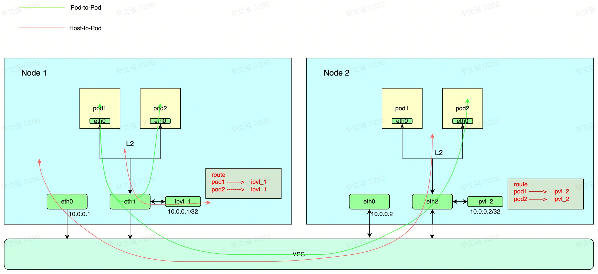

# Cello CNI Network Plugin

English | [简体中文](./README-zh_CN.md)

# Overview
Cello is a kubernetes [CNI] plugin based on the Volcengine VPC network. By using the Cello plugin, the intercommunication of the internal network of the kubernetes cluster can be realized in the VPC network environment on the cloud. The kubernetes cluster can natively access to other resources under the same VPC when the access is allowed by security group. Cello uses [secondary ENI] to build the Pod network, and supports shared ENI mode and ENI multi-IP mode. In both modes, the following basic communication scenarios are supported:
* Pod to Pod communication
* Pod to Node communication

Cello replaces kube-proxy with [Cilium] to implement kubernetes services to achieve better performance and richer features. It supports the following types of services:
* ClusterIP
* NodePort
* LoadBalancer

## Cello mode

### ENI-Multi-IP

In the ENI-Multi-IP mode, Cello assigns multiple secondary private IPs under the secondary ENI to multiple Pods to achieve higher deployment density. The number of Pods on ECS depends on instance type ([limit]). Since each Pod is assigned an address within the VPC, all Pods and Nodes are almost the same in the VPC perspective. In addition to communicating through VPC, Pod can communicate with its Node through local fast path.

### Exclusive-ENI

In exclusive mode, Cello assigns the secondary ENI directly to the Pod, pulls the secondary ENI into the Pod's NetNs and uses the primary IP of the secondary ENI for communication. From the perspective of VPC, all Pods and Nodes are the same. Limited by the number of secondary ENIs that can be attached on the ECS, the Pod deployment density in this mode is much lower. In addition to communicating through VPC, Pod also can communicate with its Node through the local `veth-pair`.

## Build
### Required
* protobuf 
* go 1.20+ 
* docker [option]

### Bin
```bash
git clone [todo]
cd cello
go mod download
make bin
```
After make, all the programs and configuration files required for deployment are located in the `output` directory.

### Image
```bash
git clone [todo]
cd cello
go mod download
make image 
```
Docker is used by default, and can be compiled with podman through ARG `ENGINE`. The image name can be through by ARG `IMAGE_NAME`.

## Installation
### Install Kubernetes
* Prepare the Volcengine ECS instance (ECS instance kernel version 4.19+ is required, and the tested OS is veLinux 1.0 with 5.10 kernel).
* Install Kubernetes, [kubeadm] is recommended.

### Install Cello
* Make sure the `credentialAccessKeyId` or `ramRole` passed to Cello has associated the required [IAM policy](docs/iam-policy.md).
* Refer to [config.md](docs/config.md) to prepare the configuration.
*  Install using helm (helm 3.0 is required).
    ```shell
    helm install cello chart
    ```

## Test
### Unit Test
```bash
git clone [todo]
cd cello
go mod download
make test
```
### Function Test  
Make sure the cluster has installed Cello correctly and `kubectl` can connect to the cluster.
```bash
git clone [todo]
cd cello
./tests/test.sh
```

## Built With
[Cilium]: Cello integrate Cilium components to support NetworkPolicy and optimize the Service performance. Cilium watch NetworkPolicy and Service configuration and inject ebpf program into pod's primary device.

## Community
### Contributing
See the [CONTRIBUTING.md](./CONTRIBUTING.md) file for details.

### Contact
If you have any questions or want to contribute, you are welcome to communicate most things via GitHub issues or pull requests. Or Contact to Maintainers via email or Feishu group below.

   


### License
Cello is under the Apache 2.0 license. See the [LICENSE](./LICENSE) file for details.


[CNI]: https://www.cni.dev/
[secondary ENI]: https://www.volcengine.com/docs/6401/68940#%E7%BD%91%E5%8D%A1
[Cilium]: https://cilium.io/
[limit]: https://www.volcengine.com/docs/6396/70840
[kubeadm]: https://kubernetes.io/docs/setup/production-environment/tools/kubeadm/create-cluster-kubeadm/